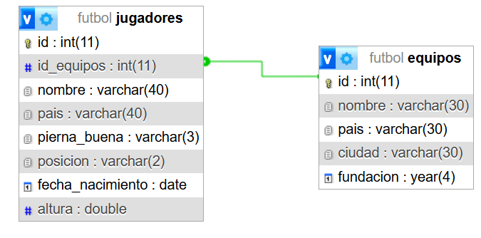

#  TPE_WEB2  

## Integrantes

Iván Batalla(ibatalla132@gmail.com)
Tomas viñals (tomas.vinals@gmail.com)

## tematica 
La tematica sera un catalogo de __futbolistas__
## descripcion

En el catalogo se incluiran jugadores de futbol, con un nombre,
el pais al que pertenece, cual es su pie dominante(der,izq,amb),
la posicion en la cual mas se destaca este mismo,
su fecha de nacimiento, su altura y a que __equipo pertenece__.

ademas cada equipo tendra un nombre, un pais, una ciudad y su año  de fundacion.

## diagrama entidad relacion 

## Sql
[SQL](./database/futbol.sql)

## como desplegar el sitio web con apache y msql

 Instalar XAMPP con los paquetes de Apache (nos dará acceso al servidor web) y MySQL ( nos permite crear y manejar bases de datos).

2- Guardar el proyecto "TPE_WEB2" o cualquiera que quieras abrir dentro de la carpeta "htdocs" donde instalaste el XAMPP (\xampp\htdocs\TPE_WEB2)

3- Abrir el programa XAMPP, y dentro del Panel de Control activar los modulos "Apache" y "MySQL" para que entren en funcionamiento

4- Con MySQL activado ingresar en 'http://localhost/phpmyadmin' crear una base de datos e importar la base de datos del proyecto. *Asegurarse que dentro del archivo 'config.php' coincidan los nombres de la base de datos

5- Ingresar en http://localhost/TPE_WEB2/ para acceder a la aplicacion.

## usuario y contraseña para acceder

usuario: admin
contraseña: 1234

