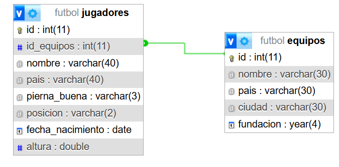

#  TPE_WEB2  

## Integrantes

Iván Batalla(ibatalla132@gmail.com)
Tomas viñals (tomas.vinals@gmail.com)

## tematica 
La tematica sera un catalogo de __futbolistas__
## descripcion

En el catalogo se incluiran jugadores de futbol, con un nombre,
el pais al que pertenece, cual es su pie dominante(der,izq,amb),
la posicion en la cual mas se destaca este mismo,
su fecha de nacimiento, su altura y a que __equipo pertenece__.

ademas cada equipo tendra un nombre, un pais, una ciudad y su año  de fundacion.

## diagrama entidad relacion 

## Sql
[SQL](futbol.sql)